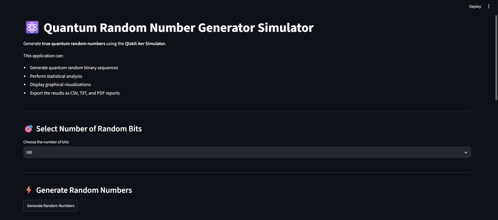
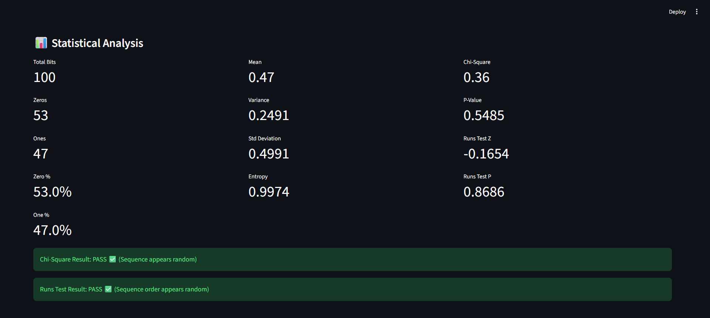
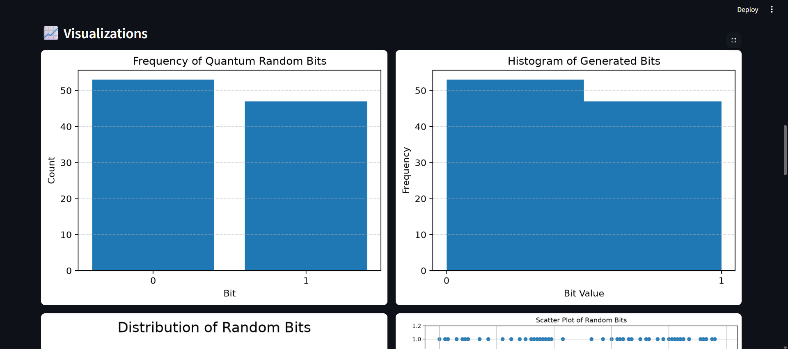

# ⚛️ Quantum Random Number Generator (QRNG) Simulator

[](https://qrng-simulator-yaswanth.streamlit.app)

## 📌 Project Description

The **Quantum Random Number Generator (QRNG) Simulator** is a computational project that models quantum randomness using principles of Quantum Mechanics. Unlike classical pseudo-random number generators (PRNGs) that rely on deterministic mathematical algorithms, this simulator models fundamental quantum processes—such as quantum superposition and measurement—to generate unpredictable, high-entropy binary sequences.

Built with Qiskit and Streamlit, this application is intended for educational purposes, demonstrations of quantum-inspired randomness, and statistical analysis.

---

## ✨ Key Features

- ⚛️ **Quantum State Simulation:** Uses the **Qiskit Aer Simulator** to create 1-qubit superposition states ($\frac{|0\rangle + |1\rangle}{\sqrt{2}}$) and perform probabilistic measurements.
- 🎯 **Configurable Bit Sequence Generation:** User-selectable bit sequence lengths (10, 50, 100, 500, 1000).
- 📊 **Statistical Randomness Analysis:** Comprehensive statistical evaluations including:
  - Bit counts and percentages (0s vs 1s)
  - Mean, Variance, and Standard Deviation
  - Shannon Entropy calculation
  - **Chi-Square Goodness-of-Fit Test** (evaluates bit uniformity)
  - **Runs Test for Randomness** (evaluates sequence order and independence)
- 📈 **Graphical Visualizations:** 
  - Bit Frequency Chart
  - Histogram
  - Distribution Pie Chart
  - Scatter Plot
  - Line Plot
- 📥 **Multi-Format Exporting:** Export generated sequences and full test reports as **CSV**, **TXT**, or a compiled **PDF Report** (complete with graphical figures).

---

## 📸 Application Screenshots

### 🖥️ Main Dashboard Overview


### 📊 Statistical Analysis


### 📈 Graphical Visualizations


---

## 🛠️ Tools & Technologies

- **Language:** Python
- **Quantum Simulation:** Qiskit, Qiskit Aer
- **Web Interface:** Streamlit
- **Data Analysis & Statistics:** NumPy, Pandas, SciPy, Statsmodels
- **Data Visualization:** Matplotlib
- **Document Generation:** ReportLab

---

## 📁 Repository Structure

```text
QRNG-Simulator/
│
├── images/             # Screenshot assets for documentation
│   ├── dashboard.png
│   ├── statistics.png
│   └── charts.png
├── app.py              # Main Streamlit web application dashboard
├── qrng.py             # Quantum circuit generation & simulator execution engine
├── statistics.py       # Statistical testing algorithms (Chi-Square, Runs Test, Entropy)
├── visualization.py    # Matplotlib chart plotting functions
├── pdf_report.py       # ReportLab PDF generation module
├── requirements.txt    # Python dependencies and version constraints
└── README.md           # Project documentation
```

---

## 🚀 Quick Start & Installation

### 1. Clone the Repository

```bash
git clone https://github.com/yaswanthkumar-laveti/QRNG-Simulator.git
cd QRNG-Simulator
```

### 2. Set Up a Virtual Environment (Optional)

```bash
python -m venv venv
# On Windows:
venv\Scripts\activate
# On macOS/Linux:
source venv/bin/activate
```

### 3. Install Dependencies

```bash
pip install -r requirements.txt
```

### 4. Run the Streamlit App

```bash
streamlit run app.py
```

---

## 👨‍💻 Author

**LAVETI YASWANTH KUMAR**  
*Quantum Random Number Generator Simulator — Internship Project*
